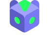

<p align="center">
  
</p>
<br />

# SKNK Foundry Example

This repo is for a Solidity / Foundry developer who wants to integrate a game contract with the SKNK protocol.

This repo centers on the contract integration pattern in [src/DemoGame.sol](src/DemoGame.sol) and [src/SLPConsumerBase.sol](src/SLPConsumerBase.sol). Everything else keeps that pattern small enough to inspect, test, and adapt.

## Start here

Read these files in this order:

1. [src/DemoGame.sol](src/DemoGame.sol)
2. [src/SLPConsumerBase.sol](src/SLPConsumerBase.sol)
3. [src/interfaces/ISLPHub.sol](src/interfaces/ISLPHub.sol)
4. [test/DemoGame.t.sol](test/DemoGame.t.sol)

If you are evaluating how to wire your own game into SKNK, those files cover the contract integration path.

## Integration pattern

The expected flow for an SLP-integrated game contract is:

1. Inherit `SLPConsumerBase` and pass the hub address in your constructor.
2. When a user plays, check whether the hub already holds balance for that user with `_getUserSlpBalance(token, user)`.
3. If the hub balance is short, pull only the outstanding amount from the user into your game contract.
4. Approve the hub for the exact stake amount for that play.
5. Create the ticket with `_createTicket(...)` or `_createTicketWithETH(...)`.
6. Emit an event with the returned `consumerId`.
7. Query status later with `_getTicketStatus(consumerId)`.
8. When withdrawing, call `_withdrawUserSlpBalance(...)`, then forward funds to the user.

Important model details:

- `consumerId` is the game-level id returned by your contract
- The hub ticket id is separate and stored in `consumerIdToTicketId`
- Hub balances are keyed by `(token, game contract, user)`
- Wins are credited to hub balance first, not paid directly to the user

When adapting `DemoGame`, keep `SLPConsumerBase` as the integration layer and replace the game-specific contract, events, state, and result handling. You do not need to keep the example role model, registry helper, or exact event names unless they fit your game.

Change the game logic around ticket creation, not the hub interaction sequence itself.

## ERC20 play flow

`DemoGame.play(pair, token, stake, chance)` shows the ERC20 path:

- Read the user's existing hub balance
- Pull only the shortfall from the wallet
- Approve the hub for that play
- Create the ticket
- Emit `GamePlayed(..., consumerId)`

The important part is that the contract does not blindly pull the full stake if the hub already holds funds for that user.

## ETH play flow

`DemoGame.playWithETH(pair, stake, chance)` shows the ETH path:

- Require `msg.value == stake`
- Call `_createTicketWithETH(...)`
- Emit the event using `hub.WETH_ADDRESS()` as the token address

The hub is responsible for wrapping ETH into WETH.

## Withdraw flow

`DemoGame.withdraw(token, amount)` shows the expected withdrawal path:

1. Withdraw the user balance from the hub into the game contract
2. Transfer the withdrawn tokens to the user
3. Emit a withdrawal event

The hub does not send funds directly to the player. Your game contract must forward them.

## Optional registry flow

If your game wants on-chain name registration:

- Set the registry with `_setGamesRegistry(address)`
- Set the name with `_setName(string)`
- Read the name with `_name()`

This is optional. It is not required for the core SLP integration flow.

## Repo layout

- [src/DemoGame.sol](src/DemoGame.sol) - Reference consumer contract
- [src/SLPConsumerBase.sol](src/SLPConsumerBase.sol) - Reusable hub integration helpers
- [src/interfaces/ISLPHub.sol](src/interfaces/ISLPHub.sol) - Expected hub interface
- [src/interfaces/IGamesRegistry.sol](src/interfaces/IGamesRegistry.sol) - Optional registry interface
- [test/DemoGame.t.sol](test/DemoGame.t.sol) - Behavior tests for the example contract
- [test/mocks/MockSLPFixtures.sol](test/mocks/MockSLPFixtures.sol) - Mocks and harnesses used by the tests
- [script/Deploy.s.sol](script/Deploy.s.sol) - Example deploy script

## Local setup

Requirements:

- [Foundry](https://book.getfoundry.sh/getting-started/installation)
- Solidity `0.8.20`
- Soldeer via Foundry

Dependencies are not checked into git. Install them locally first:

```sh
forge soldeer install
```

Then run:

```sh
forge build
forge test
forge fmt --check
```

CI uses the same commands.


## Deploying the example

The deploy script in [script/Deploy.s.sol](script/Deploy.s.sol) expects:

- `DEPLOYER_PRIVATE_KEY`
- `SLP_HUB_ADDRESS`
- `ADMIN_ADDRESS`

SKNK deployment addresses are listed at [docs.sknk.io/deployments](https://docs.sknk.io/deployments).

Set up local env values:

```sh
cp .env.example .env
set -a && source .env && set +a
```

Deploy:

```sh
forge script script/Deploy.s.sol:DeployScript --rpc-url <RPC_URL> --broadcast
```

## Production notes

- This repo is a reference example, not an audited system
- Use `SafeERC20` and keep approvals scoped tightly
- Consider `nonReentrant` on play and withdraw paths in production
- Validate cancel windows, error flows, and settlement assumptions against the actual hub you are integrating with
- Emit consistent play, result, and withdrawal events so off-chain systems can reconstruct state
